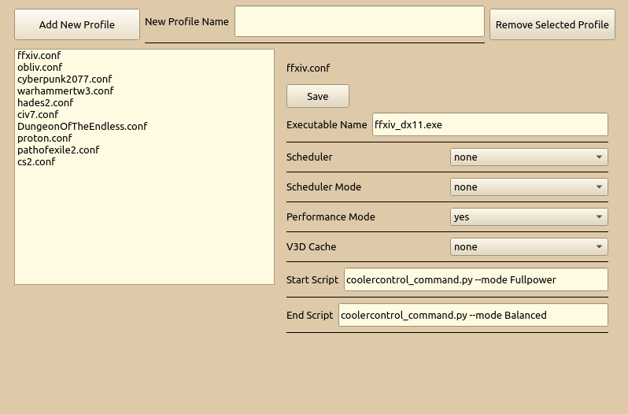

# QFalcond Profile Manager

## About

This software makes managment of falcond profiles easier.

### No AI used to make the software.

## Instalation
Download Appimage and run
```sudo QFalcondManager.AppImage --setup```

this step should not be done if it was ever done before or there was a hand made setup of user profiles directory

## Uninstall
simply remove QFalcondManager.AppImage

## Usage
no parameters starts apps gui

--setup creates users profiles directory within falcond and copies there default profiles afterwards it assigns proper rigths to currently logged user

--version displays version

--help will display help prompt

## Visuals

configuration tab:





## dependencies for development
This app uses mostly python builtin libraries only dependency required is PyQt6

``pip install PyQt6``

 
